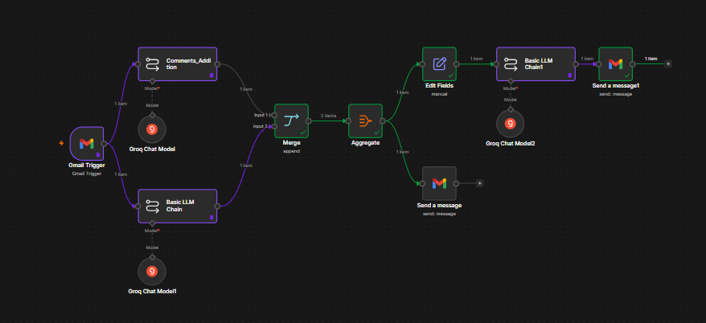
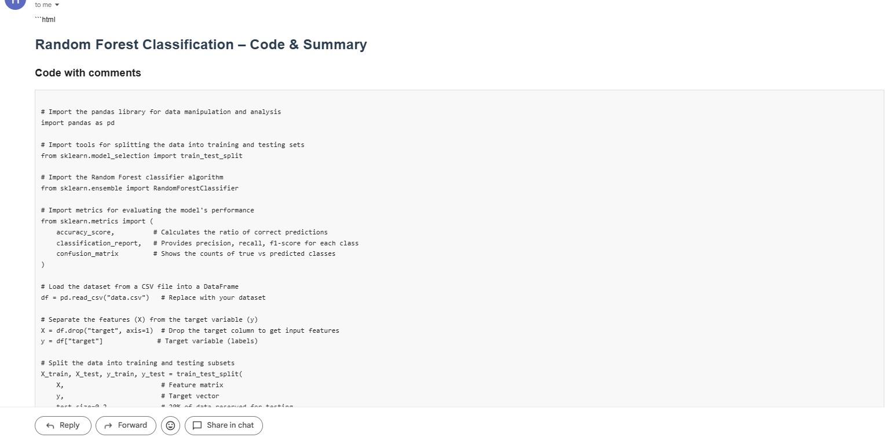
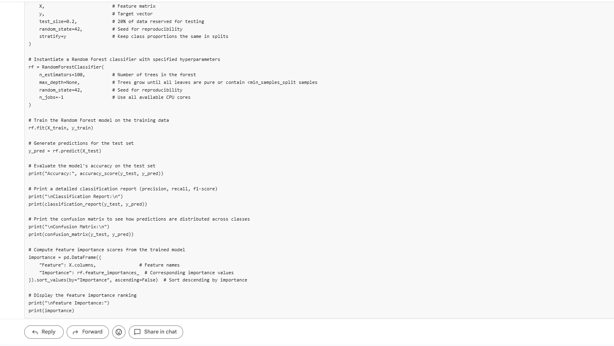
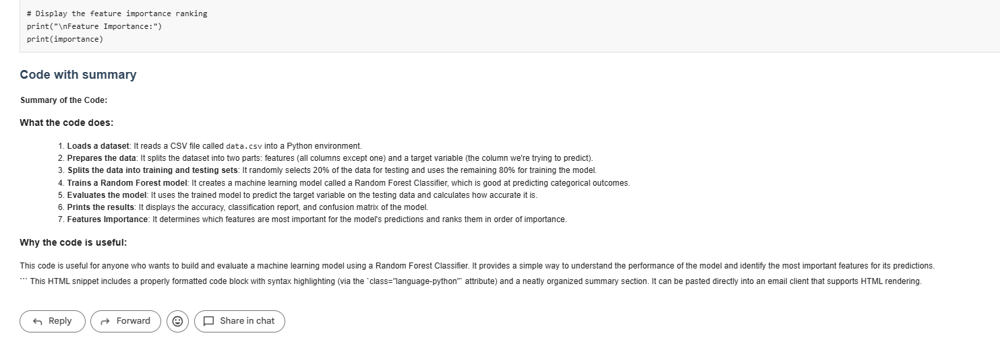

<div align="center">

# 🤖 AI Code Review Email Agent

### *AI-Powered Python Code Documentation & Email Automation using n8n, Groq GPT-OSS-20B & Gmail*



<br>


### 📩 Receive Python Code → 🤖 AI Documentation → 📧 HTML Email Response

Built with ❤️ by **Harjot Singh**

[](https://github.com/Harjotsingh1103)

</div>

---

# 📖 Overview

**AI Code Review Email Agent** is an end-to-end workflow automation project built using **n8n**, **Groq GPT-OSS-20B**, and **Gmail**.

The workflow automatically receives Python code through email, generates AI-powered documentation, formats the response into a professional HTML email, and sends it back to the user—without any manual intervention.

The project demonstrates how Large Language Models can be integrated into low-code workflow automation to build practical developer tools.

---

# ✨ Features

- 📬 Gmail Trigger Automation
- 🤖 AI-powered Python Code Analysis
- 💬 Automatic Code Comment Generation
- 📝 Beginner-Friendly Code Summarization
- ⚡ Parallel AI Execution
- 🔀 Merge & Aggregate Workflow
- 🎨 HTML Email Generation
- 📧 Automated Gmail Response
- 🛠 Low-Code Automation with n8n

---

# 🚀 Workflow Pipeline

```text
                    Incoming Email
                           │
                           ▼
                    Gmail Trigger
                           │
             ┌─────────────┴─────────────┐
             │                           │
             ▼                           ▼
      GPT-OSS-20B                 GPT-OSS-20B
   Code Commenting             Code Summarization
             │                           │
             └─────────────┬─────────────┘
                           ▼
                       Merge Node
                           │
                           ▼
                     Aggregate Node
                           │
                           ▼
                      Edit Fields
                           │
                           ▼
                  GPT-OSS-20B
             HTML Email Generation
                           │
                           ▼
                    Gmail Send Node
```

---

# 🧠 AI Workflow

The workflow utilizes **Groq's GPT-OSS-20B** model three separate times, each with a specialized prompt.

| AI Stage | Purpose |
|----------|---------|
| 💬 Code Commenting | Generates explanatory comments throughout the Python code without modifying the original implementation. |
| 📝 Code Summarization | Produces a simple, beginner-friendly summary describing what the code does. |
| 🎨 HTML Email Generation | Converts the merged AI output into a clean HTML email suitable for Gmail. |

This modular design separates **analysis**, **documentation**, and **presentation**, making the workflow easier to maintain and extend.

---

# ⚙ Workflow Steps

1. 📩 Gmail Trigger monitors the configured inbox.
2. 📄 Python code is extracted from the email body.
3. 🤖 GPT-OSS-20B generates explanatory comments.
4. 🤖 GPT-OSS-20B simultaneously generates a simplified summary.
5. ⚡ Both AI tasks execute in parallel.
6. 🔀 Responses are merged.
7. 📦 Aggregate Node combines the outputs.
8. 📝 Edit Fields prepares the combined message.
9. 🤖 GPT-OSS-20B converts the message into a professionally formatted HTML email.
10. 📧 Gmail automatically sends the generated documentation back to the user.

---

# 🛠 Tech Stack

| Technology | Purpose |
|------------|---------|
| **n8n** | Workflow Automation |
| **Groq API** | LLM Inference |
| **GPT-OSS-20B** | Code Commenting |
| **GPT-OSS-20B** | Code Summarization |
| **GPT-OSS-20B** | HTML Email Generation |
| **Gmail API** | Email Trigger & Automated Replies |
| **HTML/CSS** | Email Formatting |

---

# 📂 Repository Structure

```text
AI-CODE-REVIEW-EMAIL-AGENT/
│
├── docs/
│   ├── workflow.png
│   └── workflow_steps.md
│
├── prompts/
│   ├── comments_prompt.txt
│   ├── summary_prompt.txt
│   └── html_email_prompt.txt
│
├── sample/
│   ├── sample_input.py
│   ├── commented_output.py
│   ├── summary_output.txt
│   ├── final_email.html
│   ├── mail1.png
│   ├── mail2.png
│   └── mail3.png
│
├── workflow/
│   └── CODE_SUMMARIZER.json
│
└── .gitignore
```

---

# 💡 Prompt Engineering

Three dedicated prompts are used throughout the workflow.

### 💬 Code Comment Prompt

Adds meaningful comments to Python code while preserving every original line.

---

### 📝 Code Summary Prompt

Creates a concise explanation describing the overall functionality of the code in simple language.

---

### 🎨 HTML Email Prompt

Converts the generated documentation into a clean HTML email with formatted code blocks suitable for Gmail.

---

# 📸 Demo

## Workflow

<p align="center">

</p>

---

## Generated Email

<p align="center">

</p>

<p align="center">

</p>

<p align="center">

</p>

---

# 📄 Sample Files Included

| File | Description |
|------|-------------|
| `sample_input.py` | Original Python code received via email |
| `commented_output.py` | AI-generated commented code |
| `summary_output.txt` | AI-generated code summary |
| `final_email.html` | HTML email generated by GPT-OSS-20B |
| `CODE_SUMMARIZER.json` | Exported n8n workflow |
| `workflow_steps.md` | Workflow documentation |
| `workflow.png` | Complete workflow diagram |

---

# 🎯 Use Cases

- 📚 Understanding unfamiliar Python code
- 👨‍🎓 Programming education
- 📝 Automated code documentation
- 🤖 AI-assisted code review
- 📧 Email workflow automation
- ⚙️ n8n + LLM demonstrations
- 🚀 Developer productivity

---

# 🔮 Future Improvements

- 🌍 Multi-language code support
- 📂 Multiple file attachments
- 📑 PDF documentation generation
- 🎨 Improved syntax highlighting
- 📊 Code complexity analysis
- 🛡 Security & vulnerability checks
- 🔗 GitHub Pull Request integration
- 💬 Slack / Discord notifications
- 📚 Repository-level documentation using RAG

---

# ▶️ Getting Started

### 1. Clone the Repository

```bash
git clone https://github.com/Harjotsingh1103/AI-CODE-REVIEW-EMAIL-AGENT.git
```

### 2. Import the Workflow

Open **n8n** and import:

```text
workflow/CODE_SUMMARIZER.json
```

### 3. Configure Credentials

- Gmail OAuth2
- Groq API

### 4. Activate the Workflow

Send a Python code snippet to the configured Gmail account.

The workflow will automatically analyze the code and send back an HTML-formatted documentation email.

---

# 🤝 Contributing

Contributions, feature requests, and workflow improvements are welcome.

Feel free to fork the repository, create a feature branch, and submit a Pull Request.

---

# 📜 License

This project is licensed under the **MIT License**.

---

<div align="center">

## ⭐ If you found this project useful, please consider giving it a star!

### Built with n8n • Groq GPT-OSS-20B • Gmail Automation

### 👨‍💻 Harjot Singh

**GitHub:** https://github.com/Harjotsingh1103

</div>